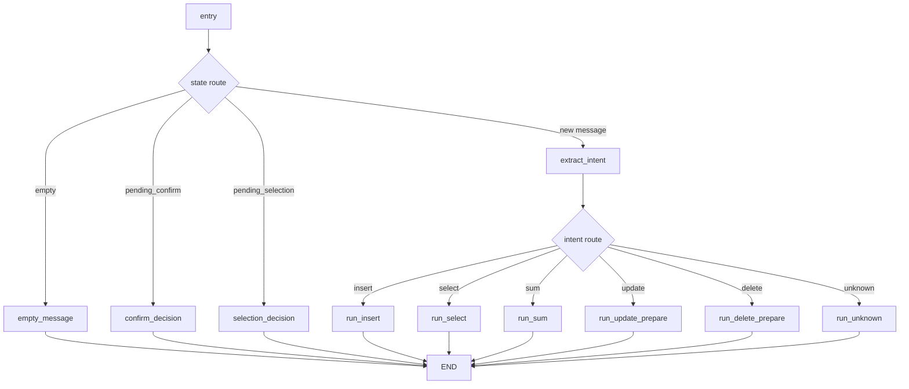

# Ledger AI MVP

## 요구사항
- Python 3.14
- Ollama (로컬 실행)

## 설치
```bash
python3.14 -m venv .venv
source .venv/bin/activate
pip install -r requirements.txt
```

## Ollama 설정
```bash
ollama pull qwen2.5:7b
ollama serve
```

선택 환경변수:
```bash
export OLLAMA_MODEL=qwen2.5:7b
export OLLAMA_BASE_URL=http://localhost:11434
export OLLAMA_TEMPERATURE=0.0
export OLLAMA_TOP_P=0.2
export OLLAMA_SEED=42
```

## 실행
터미널 1 (MCP 서버):
```bash
PYTHONPATH=. .venv/bin/python -m server.main
```

터미널 2 (클라이언트 API):
```bash
PYTHONPATH=. MCP_SERVER_BASE_URL=http://localhost:8100/mcp .venv/bin/uvicorn client.main:app --reload --port 8000
```

접속: http://localhost:8000

## 테스트
```bash
PYTHONPATH=. USE_FAKE_LLM=1 .venv/bin/pytest -q
```

## 참고
- SQLite DB 파일 기본 경로는 저장소 루트의 `ledger.db`입니다.
- LLM은 의도(intent) 추출에만 사용합니다.
- SQL 실행은 MCP 툴 핸들러(`server/mcp/handlers.py`)에서 수행합니다.
- `USE_FAKE_LLM=1` 설정 시 Ollama 없이도 결정론적 테스트가 가능합니다.
- 지원 의도: `insert`, `select`, `update`, `delete`, `sum`, `unknown`
- MCP 클라이언트는 `remote`만 지원하며 `MCP_SERVER_BASE_URL`로 서버를 지정합니다.
- MCP 설정 파일 예시는 루트의 `mcp_config.json`을 참고하세요.

## 디렉토리 개요
- `client/`: 사용자 API, LangGraph 오케스트레이션, MCP 클라이언트
- `server/`: FastMCP 서버, DB 툴 핸들러, MCP 리소스/프롬프트
- `shared/`: client/server 공통 유틸 및 MCP 계약 모델
- `tests/`: e2e + resilience + MCP 계약 테스트

## 로그 확인 포인트
- 클라이언트 호출 로그: `client.main`, `client.mcp.remote_client`
- 서버 호출 로그: `server.main`, `server.mcp.handlers`
- FastMCP 세션 로그: `mcp.server.*`

## 현재 LangGraph 구조
애플리케이션은 `client/graph.py`에서 멀티 노드 상태 머신으로 동작합니다.

### 상태 키
- `message`
- `reply`
- `pending_confirm`
- `pending_action`
- `pending_selection`
- `intent`, `intent_date`, `intent_item`, `intent_amount`, `intent_target`

### 그래프 흐름
1. `entry`: 현재 상태를 기준으로 분기
   - 빈 메시지 -> `empty_message`
   - 확인 대기(pending confirm) -> `confirm_decision`
   - 선택 대기(pending selection) -> `selection_decision`
   - 그 외 -> `extract_intent`
2. `extract_intent`: LLM JSON 파싱 + fallback 규칙 적용
3. intent 분기:
   - `insert` -> `run_insert`
   - `select` -> `run_select`
   - `sum` -> `run_sum`
   - `update` -> `run_update_prepare`
   - `delete` -> `run_delete_prepare`
   - `unknown` -> `run_unknown`
4. 실행 노드에서 `reply`와 pending 상태를 갱신하고 종료

### 확인/선택 처리
- 삭제는 반드시 확인 단계를 거칩니다 (`POST /confirm` + token + `yes|no`).
- 수정/삭제 대상이 여러 건이면 `id` 선택을 요청합니다.
- 아이템명/날짜를 지정한 수정/삭제를 지원합니다. (단순 최신 1건만 처리하지 않음)

### 날짜 처리
다음 형식을 지원합니다.
- `YYYY-MM-DD`
- `YY년 M월 D일` / `YYYY년 M월 D일`
- `M월 D일` (현재 연도 기준)
- 상대 날짜: today/yesterday/2 days ago, 오늘/어제/그제/엊그제, `N일 전`

### LLM 샘플링 파라미터
- `OLLAMA_TEMPERATURE`:
  - 토큰 선택의 무작위성 강도입니다.
  - 낮을수록(예: `0.0`) 더 결정론적이고 일관된 출력이 나옵니다.
- `OLLAMA_TOP_P`:
  - 누적 확률 상위 토큰 집합(nucleus)에서만 샘플링합니다.
  - 낮을수록 후보 폭이 좁아져 보수적인 출력이 됩니다. (`0.2`는 꽤 보수적인 설정)
- `OLLAMA_SEED`:
  - 샘플링 난수 시드입니다.
  - 같은 모델/프롬프트/옵션에서 결과 재현성을 높입니다.
  - `none`/`null`/빈 문자열이면 시드를 고정하지 않습니다.


