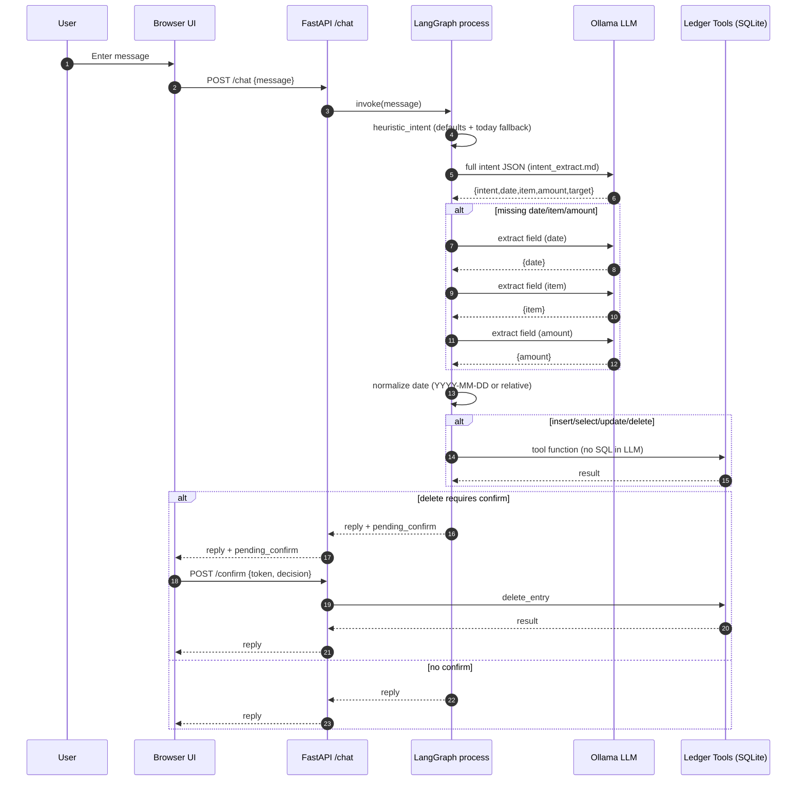

# Ledger AI MVP

## Requirements
- Python 3.11+
- Ollama (local)

## Install
```bash
python -m venv .venv
source .venv/bin/activate
pip install fastapi uvicorn requests langgraph
```

## Ollama setup
```bash
ollama pull llama3.1
ollama serve
```

Optional env vars:
```bash
export OLLAMA_MODEL=llama3.1
export OLLAMA_BASE_URL=http://localhost:11434
```

## Run
```bash
uvicorn apps.api.main:app --reload
```

Open: http://localhost:8000

## Test
```bash
USE_FAKE_LLM=1 pytest
```

## Notes
- SQLite DB file defaults to `ledger.db` at repo root.
- LLM is used only for intent extraction; DB operations run through tool functions.

## LLM Pipeline (current code)
1) Chat input hits `POST /chat` and LangGraph runs `process`.
2) `extract_intent` runs in this order:
   - Heuristic intent + fallback defaults (today if no date).
   - LLM full intent JSON (prompt: `prompts/intent_extract.md`).
   - Sequential LLM field extraction (date -> item -> amount) if still missing.
3) Date normalization:
   - Accepts YYYY-MM-DD and relative strings (today/yesterday/2 days ago, "n일 전").
4) DB operations:
   - Only tool functions in `apps/api/tools/ledger_tools.py` execute SQL.
   - Delete always requires confirm via `POST /confirm`.
   - Update/delete with multiple candidates prompts for an id selection.


